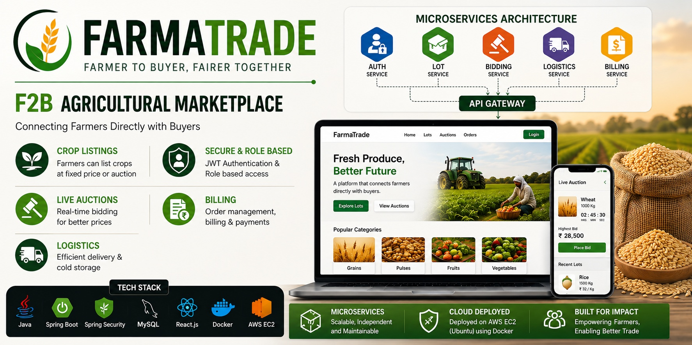

## FarmaTrade



# 🌾 FarmaTrade

**FarmaTrade** is an online agricultural marketplace that connects **farmers and buyers directly**. Farmers can list crops, buyers can participate in live auctions, and the platform manages **payments, delivery, cold storage, and invoicing** in one place.

Think of it as an **"OLX for farm crops"**, enhanced with live bidding, logistics management, automated billing, and cloud deployment.

---
# 🌾 FarmaTrade

**FarmaTrade** is a full-stack agricultural marketplace that connects **farmers and buyers directly**. Farmers can list agricultural produce, buyers can participate in live auctions, and the platform manages authentication, bidding, logistics, billing, payments, and email OTP verification.

> **Built with Java Spring Boot + ASP.NET Core .NET 10 microservices, React, MySQL, Docker, WebSockets, JWT, and REST APIs.**

---

## 🧩 Microservices Architecture

FarmaTrade follows a **microservices architecture** with **6 backend microservices**.

| Service               | Technology               | Port | Responsibility                                  |
| --------------------- | ------------------------ | ---: | ----------------------------------------------- |
| **Auth Service**      | Java + Spring Boot       | 8081 | Registration, login, JWT, roles                 |
| **Lot Service**       | Java + Spring Boot       | 8082 | Crop lot/listing management                     |
| **Bidding Service**   | Java + Spring Boot       | 8083 | Live auctions and real-time bidding             |
| **Logistics Service** | Java + Spring Boot       | 8084 | Truck booking, cold storage, weather checks     |
| **Billing Service**   | Java + Spring Boot       | 8085 | Invoice generation and Razorpay payments        |
| **OTP Service**       | **ASP.NET Core .NET 10** | 8086 | Email OTP generation, verification and delivery |

The React frontend communicates with the backend services through REST APIs, while the Bidding Service uses **WebSockets/STOMP** for real-time auction updates.

---

## 🏗️ Architecture

```text
                         Internet
                            │
                            ▼
                  ┌──────────────────┐
                  │  React Frontend  │
                  │      :3000       │
                  └────────┬─────────┘
                           │
                           ▼
                 ┌────────────────────┐
                 │    Auth Service    │
                 │ Java / Spring Boot │
                 │       :8081        │
                 └─────────┬──────────┘
                           │
                 ┌─────────┴─────────┐
                 │                   │
                 ▼                   ▼
        ┌────────────────┐   ┌────────────────────┐
        │  OTP Service   │   │   Other Services   │
        │ ASP.NET Core   │   │                    │
        │    .NET 10     │   │ Lot :8082          │
        │     :8086      │   │ Bidding :8083      │
        └───────┬────────┘   │ Logistics :8084    │
                │            │ Billing :8085      │
                ▼            └────────────────────┘
        Gmail SMTP
                │
                ▼
         User Email Inbox
```

---

## 🔐 OTP Microservice — ASP.NET Core .NET 10

FarmaTrade includes a dedicated **ASP.NET Core .NET 10 microservice** for email OTP authentication.

### Responsibilities

* Generate secure 6-digit OTPs
* Store OTP records in a dedicated MySQL database
* Hash OTP values using BCrypt
* OTP expiry handling
* Resend cooldown
* OTP verification
* Email delivery using Gmail SMTP
* Internal service authentication
* Health endpoint

### APIs

```text
POST /api/otp/send
POST /api/otp/verify
GET  /health
```

### Communication

```text
React
  ↓
Auth Service
  ↓ REST
OTP Service (.NET 10)
  ↓
Gmail SMTP
  ↓
User Email
```

The OTP service owns its own database and does not share its database with the Auth Service.

---

## 🛠️ Technology Stack

### Backend — Java

* Java 21
* Spring Boot
* Spring Security
* Spring Data JPA
* Flyway
* MySQL
* REST APIs

### Backend — .NET

* **.NET 10**
* **ASP.NET Core**
* Entity Framework Core
* MySQL
* MailKit
* BCrypt password/OTP hashing
* REST APIs

### Real-Time Communication

* WebSockets
* STOMP

### Frontend

* React
* React Router
* Leaflet
* JavaScript
* HTML
* CSS

### Payments

* Razorpay Test/Production Integration

### DevOps

* Docker
* Docker Compose
* Linux / Ubuntu
* Git
* GitHub

---

## 🌱 Key Features

* 👨‍🌾 Farmer registration
* 🛒 Buyer registration
* 📦 Crop listing and lot management
* 🔨 Live crop auctions
* ⚡ Real-time bidding using WebSockets
* 🔐 Email OTP verification
* 🔑 JWT authentication
* 👥 Role-based authorization
* 🧾 Automatic invoice generation
* 💳 Razorpay payment integration
* 🚚 Truck booking
* ❄️ Cold-storage discovery
* 🌦️ Weather-risk checking
* 🐳 Fully Dockerized microservices
* 🗄️ Separate MySQL database per service

---

## 📁 Project Structure

```text
Farmatrade1/
│
├── auth-service/
│   ├── src/
│   ├── Dockerfile
│   └── ...
│
├── lot-service/
│   ├── src/
│   ├── Dockerfile
│   └── ...
│
├── bidding-service/
│   ├── src/
│   ├── Dockerfile
│   └── ...
│
├── logistics-service/
│   ├── src/
│   ├── Dockerfile
│   └── ...
│
├── billing-service/
│   ├── src/
│   ├── Dockerfile
│   └── ...
│
├── otp-service/
│   ├── Controllers/
│   ├── Services/
│   ├── Data/
│   ├── Models/
│   ├── Middleware/
│   ├── Migrations/
│   ├── Program.cs
│   ├── Dockerfile
│   └── FarmaTrade-OTP-Service.csproj
│
├── frontend/
│   ├── src/
│   ├── public/
│   ├── Dockerfile
│   └── nginx.conf
│
├── docker-compose.yml
├── .env.example
├── .gitignore
└── README.md
```

---

## 🐳 Docker Deployment

The root `docker-compose.yml` is the **canonical full-stack Docker configuration**.

### 1. Clone the repository

```bash
git clone https://github.com/AkashShinde65/Farmatrade1.git
cd Farmatrade1
```

### 2. Configure environment variables

Create `.env` from `.env.example`:

```bash
cp .env.example .env
```

Configure required values such as:

```text
Database credentials
Internal service token
JWT configuration
Gmail username
Gmail App Password
Razorpay credentials
API keys
```

### 3. Build all services

```bash
docker compose build
```

### 4. Start the complete stack

```bash
docker compose up -d
```

### 5. Check service status

```bash
docker compose ps
```

Expected application ports:

| Component         | Port |
| ----------------- | ---: |
| React Frontend    | 3000 |
| Auth Service      | 8081 |
| Lot Service       | 8082 |
| Bidding Service   | 8083 |
| Logistics Service | 8084 |
| Billing Service   | 8085 |
| OTP Service       | 8086 |

---

## 🔗 Service Communication

Services communicate through the Docker network:

```text
                    ┌─────────────────┐
                    │   Auth Service  │
                    │      :8081      │
                    └────────┬────────┘
                             │
                    REST / JWT / JWKS
                             │
        ┌────────────────────┼────────────────────┐
        │                    │                    │
        ▼                    ▼                    ▼
 ┌──────────────┐    ┌──────────────┐    ┌──────────────┐
 │ Lot Service  │    │   Bidding    │    │  Logistics   │
 │    :8082     │    │    :8083     │    │    :8084     │
 └──────────────┘    └──────────────┘    └──────────────┘
                             │
                         WebSockets
                             │
                             ▼
                      ┌──────────────┐
                      │   Billing    │
                      │    :8085     │
                      └──────────────┘

                    Auth Service
                         │
                      REST API
                         │
                         ▼
                  ┌──────────────┐
                  │  OTP Service │
                  │ ASP.NET Core │
                  │    .NET 10   │
                  │     :8086    │
                  └──────┬───────┘
                         │
                     Gmail SMTP
```

---

## 🗄️ Database Architecture

Each microservice maintains its own database.

```text
Auth Service       → farmatrade_auth_db
Lot Service        → farmatrade_lot
Bidding Service    → farmatrade_bidding
Logistics Service  → farmatrade_logistics
Billing Service    → farmatrade_billing
OTP Service        → farmatrade_otp
```

This provides **database isolation between microservices**.

---

## 🔐 Security

FarmaTrade implements:

* JWT-based authentication
* RSA-based JWT signing
* JWKS-based token validation
* Role-based access control
* Service-to-service authentication
* BCrypt hashing
* Environment-based configuration
* Docker network isolation
* Separate database per microservice
* CORS configuration
* Secure Razorpay integration
* SMTP App Password authentication

### Secrets

**Never commit:**

```text
.env
Gmail App Passwords
Database passwords
JWT private keys
Razorpay secrets
API keys
Internal service tokens
```

Use `.env.example` for placeholders.

---

## 🧪 Local Testing

Frontend:

```text
http://localhost:3000
```

Auth:

```text
http://localhost:8081
```

Lot:

```text
http://localhost:8082
```

Bidding:

```text
http://localhost:8083
```

Logistics:

```text
http://localhost:8084
```

Billing:

```text
http://localhost:8085
```

OTP health:

```text
http://localhost:8086/health
```

Check containers:

```bash
docker compose ps
```

Check logs:

```bash
docker compose logs --tail=100 auth-service
docker compose logs --tail=100 otp-service
```

---

## ☁️ Cloud Deployment

The application is designed to be deployed using container-based cloud infrastructure.

Planned production architecture:

```text
GitHub
   ↓
Container Registry
   ↓
Container-based Cloud Platform
   ├── Auth Service
   ├── Lot Service
   ├── Bidding Service
   ├── Logistics Service
   ├── Billing Service
   ├── OTP Service
   └── React Frontend
   ↓
Managed MySQL
   ↓
HTTPS + Custom Domain
```

The production deployment can use environment-specific configuration without changing the application architecture.

---

## 🎯 Project Goal

FarmaTrade aims to provide a **transparent, technology-driven agricultural marketplace** that enables farmers and buyers to interact directly while supporting real-time auctions, logistics, payments, invoicing, and secure authentication.

---

## 👨‍💻 Developer

**Akash Shinde**

GitHub:
https://github.com/AkashShinde65

Project Repository:
https://github.com/AkashShinde65/Farmatrade1

---

## 📌 Project Highlights

**6 Microservices**

* 5 Java Spring Boot services
* 1 ASP.NET Core .NET 10 service

**Key technologies**

```text
Java 21
Spring Boot
Spring Security
ASP.NET Core .NET 10
React
MySQL
Entity Framework Core
WebSockets
STOMP
JWT
JWKS
Docker
Docker Compose
Razorpay
Gmail SMTP
GitHub
```

> **FarmaTrade combines Java and .NET microservice development in a single full-stack production-oriented project.**
